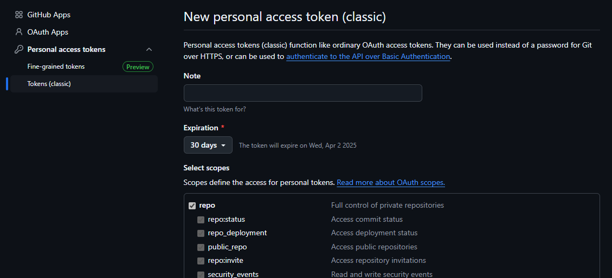

# Leak Checker
This is a program that uses the git rev-list and grep commands and github API to scan all your github repos for a string match (eg: an API key you accidentally committed.), including git history across all branches.

## Dependencies
- No external packages. No environmental variables either.
- A personal access token for each github username will be required.
- Also the github account that's authenticated in the user's PC's terminal (i.e. the github account you push stuff as) will need collaborator permissions if this program is been used with other github usernames (i.e. if the account you normally use is "A" and you need to scan "B"'s github, in addition to entering their personal access token, your "A" account will need collaboarator permission on B's repos, otherwise they will not be found.).

## Scope
Scans all the github repos for which the account is the **owner**.

## How 2 Run Program
- User has to include the secrets.txt and usernames.py files in the input folder.
- If the files have not been created or if user wants to know the template of usernames.py, just run main.py once, and the templates will be created.
- secrets.txt - just paste each text item per line (no need "")
- usernames.py - include the pairs as python strings (include "") - the github username and a personal access token (**New personal access token (classic)**). Make sure the the access token has "repo" permission. 
- Then run main.py. 

## How 2 Read the Output
- Terminal output will start by showing the username been processed and the number and names of repos found (you can use this for verification)
- Then terminal will show each repo been downloaded (**or not - errors** will be in red or yellow, if terminal supports ANSI color codes).
    - Sometimes downloads may fail due to poor internet connection, etc. **so watch out for the messages in case of errors or something unexpected.**
- If there are any string matches, they will be printed below the downloaded message.

## Artifacts
- **The cloned repos will accumulate in the created downloads folder.**

## How it Works
- Program scans for the user input
- Repo info pulled thru github API
- Repeat:
    - A repo is cloned
    - Use the git rev-list and grep commands and loop thru each 'secret'. If a match is found it's printed by the git grep command.

## If Any Repos are Skipped
If any repos are skipped due to connection errors, etc, modify main.py to run the search on just those repos.
Search for "whitelisted_remotes" in main.py - there is a commented out code snippet that can be used.

## What to do if a key has been leaked
- If the repo is or has been public, then the key must be changed, but if not:
- Use git-filter-repo.  It's a python package that can be installed with pip.
- Usage - for nuking the file (useful if it was something non-critical like a notebook): git filter-repo --invert-paths --path <path to the file or directory>